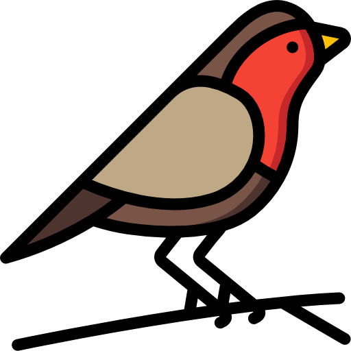
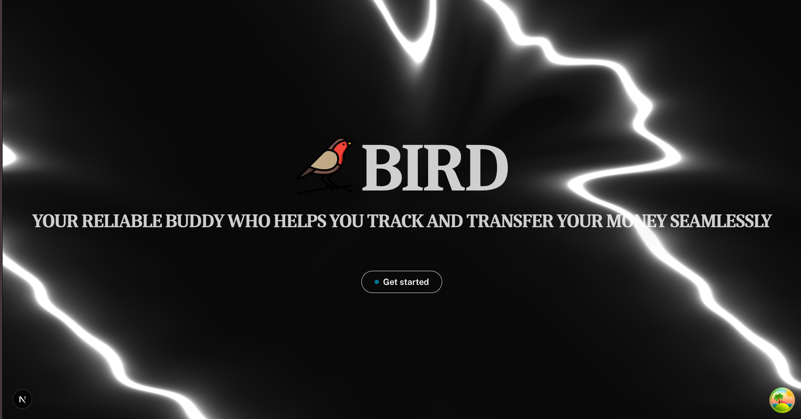
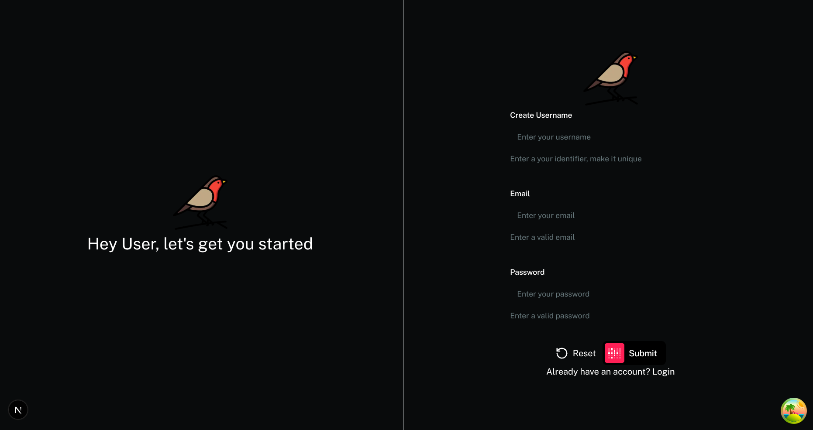

# 
</img>Bird

## Overview

**Bird** is a Ledger-based application that provides a way to manage and send financial transactions.

## Gallery

1. Landing Page

2. Register Page

## Tech Stack

- Frameworks: Spring Boot (v4.0.6), Next.js (v16.2.4)
- Language: Java (v21), TypeScript (v6.0.3)
- Frontend: React (v19.2.5), Tailwind CSS (v4.0.6), Biome (v2.4.14), Tanstack Query (v5.85.5)
- Backend: Spring Security, Spring Data JPA, Spring Kafka, Lombok, Validation
- Database: PostgreSQL (v16.10) - served via Docker
- Communication: RESTful API (Synchronous), Apache Kafka (Asynchronous)
- Tools & DevOps: Bun (v1.3.13), Gradle (v9.4.0), GitHub Actions, Docker (v28.2.2)
- Testing: JUnit (v5.11.4)
- Cloud: AWS (RDS, Fargate, MSK), ServiceNow ITSM